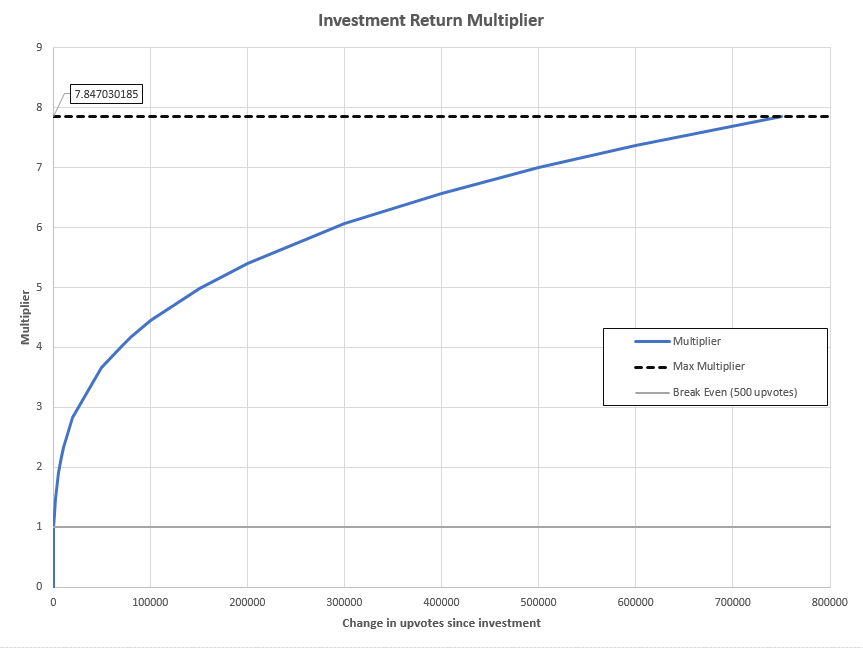

# u/MemeInvestor_bot Documentation

## Table of Contents

- [Welcome to Meme Investment!](#welcome-to-meme-investment)
- [The duty](#the-duty)
- [Commands](#commands)
- [Getting started](#getting-started)
- [Prerequisites](#prerequisites)
- [Installation and configuration](#installation-and-configuration)
- [Deployment](#deployment)
- [Source code](#source-code)
- [Authors](#authors)
- [License](#license)
- [Lists](#lists)
    - [TODO](#todo)
    - [DONE](#done)


## Welcome to Meme Investment!

Welcome to the source code page of u/MemeInvestor_bot! Nice to meet you. First
of all, let me talk you through what the bot does and details later. Quick note,
if you want to contribute, do so! Check the TODO list and help the Meme
Investments thrive! /Thanks!/


## The duty

This bot has been developed exclusively for r/MemeEconomy. It can create
investment account, help invest and then automatically return calculated
investment 4 hours after the investment. To calculate the investment return, the
bot multiplies the invested amount by a power function of the form *y = Ax^m*,
where *A* and *m* are constants (*A=0.15* , *m=0.44*) and *x* is the change in
upvotes on the post since the invesment was made. This function was originally
written to emulate/replace the block of if/else statements that was originally
used to calculate the investment return. However it has now been designed such
that the overall behavior of the function is a steep rise towards the break-even
threshold (y=1) at ~74/75 upvotes, and levelling off towards higher upvote
changes. There is also an upper cap imposed on the function at 283,000 upvotes
(highest voted post of all time on reddit) with a max multiplier of
approximately 37.57 times the original investment. Any gain in upvotes at or
above this cap will recieve this maximum multiplier.  


Investment Return Multiplier Graph


## Commands

Currently, it has 8 commands:

- `!create` - creates a bank account for you with a new balance of 1000
  MemeCoins.
- `!invest AMOUNT` - invests AMOUNT in the meme (post). 4 hours after the
  investment, the meme growth will be evaluated and your investment can profit
  you or make you bankrupt. Minimum possible investment is 100 MemeCoins.
- `!balance` - returns your current balance.
- `!active` - returns a number of active investments.
- `!broke` - only if your balance is less than 100 MemeCoins and you do not have
  any active investments, declares bankruptcy on your account and sets your
  balance to 100 MemeCoins (minimum possible investment). 
- `!market` - gives an overview for the whole Meme market.
- `!ignore` - ignores the whole message.
- `!help` - returns this help message.

To invoke any command, type it in the comment sections of r/MemeEconomy


## Getting started 

These instructions will get you a copy of the project up and running on your
local machine for development and testing purposes. See deployment for notes on
how to deploy the project on a live system. 


## Prerequisites

In order to run this application, you need to install [praw](https://github.com/praw-dev/praw), Python Reddit API Wrapper. This will be the main and only package to connect to Reddit's API and extract desired data.

```
sudo pip3 install praw
```

Alternatively, you can execute the following command:

```
sudo pip3 install --upgrade -r requirements.txt
```


## Installation and configuration

The only thing that needs to be done before execution is the config. The only
thing that needs to be done before execution is the config profile. In the
config profile you should fill your Reddit API details.

For that please follow the steps below:

```
git clone https://github.com/thecsw/memeinvestor_bot
cd memeinvestor_bot
mv example.config.py config.py
nano config.py
```

After filling out the details, save and exit. You're done with installation.


## Deployment

Remove the word **'example'** from the title of all files with it.

Just run this

```
python3 main.py
```

It is time to make a fortune!


## Source code

I will post an update to the source code later!


## Authors

 - *Sagindyk Urazayev* - Initial work and SQL Rewrite - [thecsw](https://github.com/thecsw)
 - *jimbobur* - Heavy additions to investment logic - [jimbobur](https://github.com/jimbobur)
 - *ggppjj* - Minor Fixes - [ggppjj](https://github.com/ggppjj)
 - *rickles42* - Minor Fixes - [rickles42](https://github.com/rickles42)
 - *TwinProduction* - Improved README - [TwinProduction](https://github.com/TwinProduction)


## License

This project is licensed under the The GNU General Public License (see the
[LICENSE.md](https://github.com/thecsw/prequelmemes_bot/blob/master/LICENSE) file for details), it explains everything pretty well. 


## Lists

This is going to be a short todo list. If you have the true loyalty and some
free time, try to add/fix the following todo items or add your own with the
issues tab or push.

### TODO

### DONE
